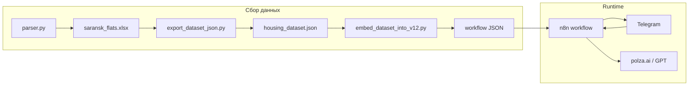

# AI Housing Assistant

Telegram-бот для поиска и анализа объявлений о продаже квартир. Пользователь пишет запрос на естественном языке («2к до 5 млн, не первый этаж»), бот подбирает варианты из локального датасета и формирует ответ с оценкой цены за м² и кратким AI-разбором каждого объявления.

Пилотный город — **Саранск**; архитектура рассчитана на масштабирование на другие регионы за счёт смены URL парсера и датасета.

## Возможности

- Сбор объявлений с Avito через Playwright-парсер с экспортом в Excel и JSON
- Разбор запроса на русском языке: комнаты, цена, площадь, этаж, район, «не первый / не последний этаж»
- Фильтрация по встроенному датасету (~2200+ объявлений на момент съёма)
- LLM-анализ каждого варианта: плюсы, минусы, риски, вердикт по цене за м²
- Ответ в Telegram с разбивкой длинных сообщений на части

## Архитектура



**Стек:** Python (Playwright, openpyxl) · n8n · PostgreSQL · Docker Compose · nginx · Telegram Bot API · LLM через [polza.ai](https://polza.ai) (OpenAI-compatible).

## Версии workflow

| Файл | Описание |
|------|----------|
| `workflows/Housing Assistant v12.json` | Основная версия для демо и отчёта: Telegram → Parse Query → Filter Dataset → LLM → ответ |
| `workflows/Housing Assistant v13.json` | Расширенная: добавлены геокодирование (Yandex) и POI вокруг адреса (Overpass) |

Для быстрого старта рекомендуется **v12**. В workflow уже встроен снимок датасета — бот работает сразу после импорта, без повторного парсинга.

## Структура репозитория

```
├── docker-compose.yml      # n8n + PostgreSQL + nginx
├── nginx/                  # reverse proxy для webhook
├── db/init.sql             # схема для профилей и подписок (задел)
├── files/
│   ├── parser.py           # парсер Avito → Excel
│   ├── export_dataset_json.py
│   └── eval_parse_query.py # метрика Parsing Accuracy
├── workflows/              # экспорт n8n + скрипт вшивки датасета
├── .env.example            # шаблон переменных окружения
└── requirements.txt        # зависимости парсера
```

## Быстрый старт

### 1. Клонирование и окружение

```powershell
git clone https://github.com/YOUR_USERNAME/AI_housing.git
cd AI_housing
copy .env.example .env
```

Заполните `.env`: как минимум `OPENAI_API_KEY`, `TELEGRAM_BOT_TOKEN`, `WEBHOOK_URL` (публичный URL для webhook Telegram).

> **Важно:** в `docker-compose.yml` включён `N8N_BLOCK_ENV_ACCESS_IN_EXPRESSIONS=false`, чтобы в HTTP-узлах работали выражения `$env.TELEGRAM_BOT_TOKEN` и `$env.OPENAI_API_KEY`. Не публикуйте `.env` в репозиторий.

### 2. Запуск n8n

```powershell
docker compose up -d
```

Интерфейс n8n: `http://localhost` (или порт из `NGINX_HTTP_PORT`). Логин/пароль — из `N8N_BASIC_AUTH_*`.

Для локальной разработки с Telegram webhook нужен туннель (ngrok, Cloudflare Tunnel и т.п.). Укажите его URL в `WEBHOOK_URL` и `N8N_EDITOR_BASE_URL`.

### 3. Импорт workflow

1. Откройте n8n → **Import from File**
2. Выберите `workflows/Housing Assistant v12.json`
3. В узле **Telegram Trigger** привяжите credential **Telegram account** (токен из `@BotFather`)
4. Активируйте workflow

Ключи LLM и отправки сообщений подтягиваются из переменных окружения контейнера — в JSON workflow секретов нет.

### 4. Проверка в Telegram

Напишите боту, например:

```
2к до 5 млн, не первый этаж
```

## Парсер и обновление датасета

Парсер — отдельный Python-процесс, не входит в Docker-стек.

```powershell
python -m venv venv
.\venv\Scripts\Activate.ps1
pip install -r requirements.txt
playwright install chromium
python .\files\parser.py
```

Результат: `files/saransk_flats.xlsx`. Далее:

```powershell
python .\files\export_dataset_json.py
python .\workflows\embed_dataset_into_v12.py
```

После этого переимпортируйте обновлённый workflow в n8n.

> **Disclaimer:** парсинг Avito может нарушать пользовательское соглашение площадки. Используйте код только в учебных/исследовательских целях, соблюдайте robots.txt и rate limits. Для продакшена рассмотрите официальные API или легальные источники данных.

## Переменные окружения

| Переменная | Обязательна | Назначение |
|------------|-------------|------------|
| `TELEGRAM_BOT_TOKEN` | да | Токен бота от BotFather |
| `OPENAI_API_KEY` | да | Ключ polza.ai / OpenAI для узла **OpenAI Analyze** |
| `WEBHOOK_URL` | да | Публичный URL для webhook n8n |
| `N8N_ENCRYPTION_KEY` | да | Ключ шифрования credentials n8n |
| `POSTGRES_PASSWORD` | да | Пароль БД n8n |
| `YANDEX_GEOCODER_API_KEY` | для v13 | Геокодирование адресов |
| `YANDEX_ORG_SEARCH_API_KEY` | опционально | Поиск организаций (задел) |

Полный список — в `.env.example`.

## Оценка качества Parse Query

Скрипт прогоняет 10 тестовых запросов через логику узла **Parse Query** из v12:

```powershell
python .\files\eval_parse_query.py
```

Метрика: **Parsing Accuracy** — доля запросов, где извлечённые фильтры совпали с эталоном.

## Команда

Учебный проект (практикум / курсовая работа). Авторы: Artemyev, Fomin, Luzin, Goncharov, Kuchina, Rodionov, Buyankina, Pelina, Chukarova, Brekhov.

## Лицензия

Код распространяется «как есть» в учебных целях. При публикации форка укажите авторов и не включайте реальные API-ключи.
